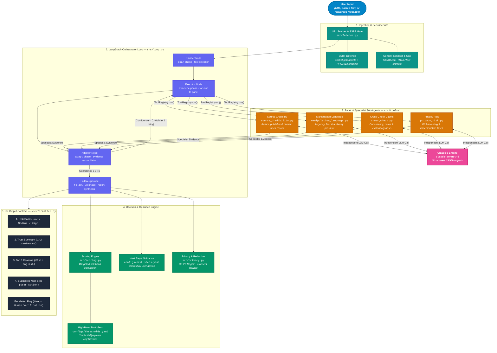

# Verification Agent: A Duty-of-Care Verification Agent for Everyday Misinformation

[](https://www.python.org/downloads/)
[](https://langchain-ai.github.io/langgraph/)
[](https://www.anthropic.com/)
[](tests/)
[](LICENSE)

> **One-Line Value Proposition:** A bounded, privacy-first AI safety check for online claims and messages — providing non-technical users with clear, transparent reasoning before they act or share.

---

## Executive Summary & Context

As a solution architect specialising in cloud-native applications, data engineering, and AI across healthcare (Elekta oncology informatics) and critical event response (International SOS travel risk management), I build minimum viable prototypes (MVPs) aimed at duty-of-care challenges.

In the UK, public trust and digital safety are at a critical juncture:

- **81% of UK adults** report concern over distinguishing real from fake information online (ONS Public Opinions and Social Trends Survey).
- **77% worry about personal data usage** without explicit consent.
- **£1.17 billion was lost in 2024 to Authorised Push Payment (APP) fraud** in the UK alone (UK Finance), with the vast majority initiated via forwarded messaging apps and social media impersonation.
- Only **36% of the public believe AI will benefit them personally** — a metric that continues to decline due to opaque, black-box AI products.

Existing tools fall into two extremes: complex newsroom fact-checking suites unsuitable for rapid personal use, or simple browser URL blocklists that miss novel scam domains, out-of-context text, and health misinformation.

The **Verification Agent** addresses this gap. It acts as an everyday "pause-and-check" safety layer for URLs, forwarded WhatsApp messages, headlines, and SMS text. It runs a panel of four independent specialist sub-agents, reconciles evidence through a deterministic LangGraph state loop, and produces an immutable **4-block plain-English verdict**.

---

## Key Features & Safety Principles

1. **Panel of Specialists**: Four independent Claude 5 Sonnet analysts run in parallel isolation (Source Credibility, Rhetorical Manipulation, Claim Cross-Checking, and Privacy/Scam Risk).
2. **Deterministic Agentic Loop**: Built on LangGraph `StateGraph` following a Plan → Execute → Adapt → Follow-up pipeline architecture.
3. **SSRF-Protected URL Ingestion**: Hostname resolution and multi-layer validation block access to non-routable IPs (RFC 1918, loopback, link-local, AWS metadata endpoints `169.254.169.254`).
4. **Consent-Gated PII Redaction**: Regex-based redaction strips UK National Insurance numbers, bank account details, payment cards, phone numbers, and email addresses prior to history persistence.
5. **Strict UX Output Contract**: Guarantees four blocks on every response (**Risk Band**, **Trust Summary**, **Top 3 Reasons**, **Suggested Next Step**). Never issues a verdict without transparent reasoning.
6. **No Autonomous Side Effects**: The agent advises and informs; it never auto-blocks, reports, or contacts third parties on the user's behalf.

---

## System Architecture

The orchestrator manages execution across five distinct layers: ingestion, orchestration, specialist evaluation, scoring synthesis, and response formatting.



---

## The Panel of Specialists

Each tool in `src/tools/` is an autonomous specialist sub-agent wrapped by `ToolRegistry`:

| Specialist Sub-Agent | Primary Focus | Key Output Signals | System Prompt Focus |
|---|---|---|---|
| **`check_source_credibility`** | Origin & domain verification | `source_known`, `author_identifiable`, `domain_age_signal`, `credibility_score` | Evaluates publisher history, transparency, and domain authenticity. |
| **`detect_manipulation_language`** | Rhetorical analysis | `urgency_present`, `fear_language`, `authority_pressure`, `evidence_snippets` | Identifies emotional pressure, forced urgency, and coercion phrasing. |
| **`cross_check_claims`** | Fact & date consistency | `claim_supported`, `date_context_ok`, `evidence_quality`, `consistency_score` | Checks internal factual consistency, dates, and verifiable attributions. |
| **`privacy_risk_check`** | Scam & PII solicitation | `pii_solicitation`, `payment_pressure`, `credential_harvesting`, `impersonation` | Flags credential harvesting, bank account requests, and impersonation. |

---

## Technical Hardening & Engineering Decisions

### 1. SSRF Defense in URL Fetcher (`src/fetcher.py`)
To prevent Server-Side Request Forgery (SSRF), `prepare_content()` performs a strict multi-stage validation before connecting:
- Hostname resolution via `socket.getaddrinfo()`.
- Explicit verification against private and non-routable IP ranges (RFC 1918 `10.0.0.0/8`, `172.16.0.0/12`, `192.168.0.0/16`, loopback `127.0.0.0/8`, link-local / AWS metadata `169.254.0.0/16`, CGNAT `100.64.0.0/10`, IPv6 ULA `fc00::/7`).
- Manual redirect tracking (up to 3 hops) with IP re-validation on every hop to block public-to-private redirect exploits.
- Strict HTTP content-type allowlist (`text/html`, `text/plain`, `application/xhtml+xml`) and 500 KB response body streaming cap.

### 2. Robust Non-Greedy JSON Extraction (`src/tools/_shared.py`)
LLMs often append commentary around structured JSON. standard regex matches (`\{.*\}`) fail greedily across multi-object outputs. `_extract_json()` employs a character-by-character `JSONDecoder().raw_decode()` loop starting at every `{` position, guaranteeing extraction of the first complete, syntactically valid JSON object.

### 3. Boolean Coercion Safeguard
In Python, `bool("false")` evaluates to `True`. To prevent LLM string responses like `"false"` from flipping risk flags, `_as_bool()` explicitly handles string variants (`"true"`, `"false"`, `"yes"`, `"no"`, `"1"`, `"0"`).

### 4. Consent-Gated PII Redaction (`src/privacy.py`)
User history storage is disabled by default (`HISTORY_CONSENT=false`). When enabled for audit purposes, `redact_pii()` redacts sensitive details via regex:
- **UK NI Numbers**: `[NI_NUMBER]`
- **Payment Cards**: `[CARD_NUMBER]`
- **UK Phone Numbers**: `[PHONE]` (using lookbehind `(?<!\w)` for `+44` and `0` formats)
- **Bank Account Numbers**: `[ACCOUNT_NUMBER]`
- **Email Addresses**: `[EMAIL]`

---

## Repository Structure

```text
verification-agent/
├── main.py                     # CLI entrypoint & interactive mode
├── run_pilot.py                # Automated pilot test script
├── .env.example                # Environment template
├── requirements.txt            # Dependencies
│
├── configs/
│   ├── thresholds.yaml         # Signal weights, risk bands & multipliers
│   └── next_steps.yaml         # Contextual guidance mapping
│
├── src/
│   ├── state.py                # VerificationState TypedDict & Pydantic validation
│   ├── fetcher.py              # SSRF-protected URL fetcher
│   ├── loop.py                 # LangGraph orchestrator loop
│   ├── scoring.py              # Multi-signal scoring engine
│   ├── formatter.py            # 4-block UX contract formatter
│   ├── next_steps.py           # Context-aware guidance selector
│   ├── privacy.py              # PII redaction & history persistence
│   └── tools/
│       ├── adapter.py          # ToolRegistry interface
│       ├── _shared.py          # JSON parser & boolean coercer
│       ├── source_credibility.py
│       ├── manipulation_language.py
│       ├── cross_check.py
│       └── privacy_risk.py
│
├── shared/
│   ├── llm.py                  # Anthropic / Ollama factory
│   └── telemetry.py            # Latency, token count & cost tracker
│
└── tests/                      # 160 unit and scenario tests
```

---

## Quick Start & Usage

### 1. Installation

```bash
git clone https://github.com/JigsawFlux/verification-agent.git
cd verification-agent

cp .env.example .env
# Set your ANTHROPIC_API_KEY in .env

pip install -r requirements.txt
```

### 2. Execution

```bash
# Check a suspicious message
python main.py "URGENT: Your account has been suspended. Verify immediately at http://paypal-secure-verify.xyz/confirm"

# Check a news URL
python main.py "https://www.bbc.co.uk/news/articles/c04d1976077o"

# Run interactive CLI mode
python main.py

# Run pilot evaluation suite
python run_pilot.py
```

### 3. Test Suite

```bash
python -m pytest tests/ -v
```

All **160 tests** across 11 test modules run offline without external API dependencies.

---

## License

Distributed under the MIT License. See `LICENSE` for details.

*Part of the JigsawFlux open-source suite for health tech, humanitarian response, and digital duty-of-care.*
