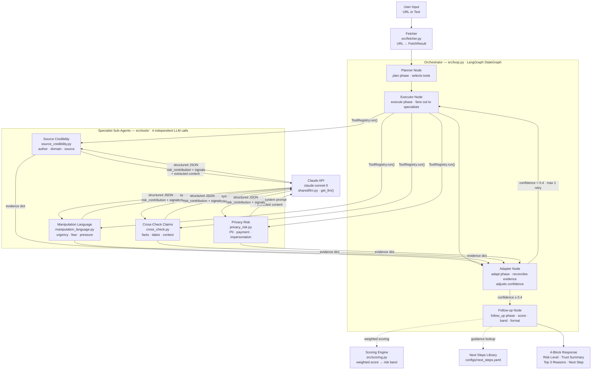

# Verification Agent (Anti-Misinformation) — One-Page Summary

## What it is

The **Verification Agent** is a public-facing AI assistant that helps people check whether online information is trustworthy **before** they act on it.

It is designed for everyday use by anyone — not just technical users.
Think of it as a "pause and check" safety layer for links, messages, headlines, social posts, and forwarded content.

---

## Why this matters now

Many people struggle to tell what is real online. Public research shows this is a top concern:

- **81%** worry about distinguishing real vs fake information online
- **77%** worry about personal data being used without consent

At the same time, trust in AI is low. So the tool must be:

1. **Simple to use**
2. **Clear about why it gives an answer**
3. **Safe with personal data**

---

## Core idea

When a user pastes a link, screenshot text, or message, the agent gives a plain-English result:

- **Likely reliable**
- **Needs caution**
- **High risk / likely misleading**

It also explains **why** in short, non-technical language.

---

## What the agent checks

1. **Source credibility**
   - Is the source known, verifiable, and consistent?
   - Is the author or organisation identifiable?

2. **Content quality signals**
   - Clickbait, emotional pressure, urgency tactics ("act now", "share now")
   - Missing evidence, vague claims, or no cited references

3. **Cross-checking**
   - Are key claims supported by other independent sources?
   - Are dates, context, and facts aligned?

4. **Manipulation patterns**
   - Impersonation, scam language, fake authority, fear-based prompts
   - Edited or out-of-context claims where detectable

5. **Privacy and safety prompts**
   - Warns users before sharing personal details or payment information

---

## User experience (simple flow)

1. User submits a link or message
2. Agent analyses it in seconds
3. Agent returns:
   - **Trust Summary** (1–2 lines)
   - **Risk Level** (Low / Medium / High)
   - **Top reasons** (bullet list)
   - **Suggested next step** (e.g., verify with official site, do not share yet)

---

## Example output (plain language)

**Risk Level:** Medium

**Trust Summary:** "This message uses urgency language and does not cite a verifiable source. Check the claim on an official website before acting."

**Why:**

- No author or organisation identified
- Claim not supported by trusted public sources
- Pressure wording: "urgent", "immediately", "forward to everyone"

---

## Safety and trust principles

- **No automatic decisions for users** — it advises; user decides
- **Transparent reasoning** — always shows why it flagged something
- **Data minimisation** — only process what is needed
- **No silent tracking** — clear consent and controls
- **Public-interest design** — reduce harm, panic, and misinformation spread

---

## Who this helps

- Students, workers, parents, and older adults
- People with low confidence in technology
- Communities exposed to scams, fake news, and misleading health/finance messages

---

## Success measures (MVP)

- % of users who say the explanation was easy to understand
- % reduction in users acting on flagged high-risk content
- Repeat usage rate (trust and usefulness signal)
- Number of risky messages stopped before sharing

---

## One-line value proposition

> "A simple AI safety check for online claims — so people can make better decisions with confidence."

---

## Implementation

### Quick start

```bash
git clone <this-repo>
cd verification-agent

cp .env.example .env
# Edit .env — add your ANTHROPIC_API_KEY

pip install -r requirements.txt

# Run a single check
python main.py "URGENT: Your account has been suspended. Click now to verify."
python main.py "https://www.bbc.co.uk/news/some-article"

# Interactive mode
python main.py

# Run the test suite
python -m pytest tests/ -v
```

---

### Tech stack

| Layer | Choice |
| --- | --- |
| Agent loop | LangGraph `StateGraph` |
| LLM | Claude Sonnet 5 via `langchain-anthropic` |
| URL fetching | `requests` + `beautifulsoup4` |
| Config | YAML (`configs/`) + `python-dotenv` |
| State validation | Pydantic v2 |
| Tests | pytest |

The LLM provider is swappable — set `LLM_PROVIDER=ollama` in `.env` to run locally with Ollama.

---

### Project structure

```text
verification-agent/
├── main.py                     # CLI entrypoint
├── .env.example                # environment variable template
├── requirements.txt
│
├── configs/
│   ├── thresholds.yaml         # risk bands, signal weights, confidence rules
│   └── next_steps.yaml         # plain-English guidance by risk band + signal type
│
├── src/
│   ├── state.py                # VerificationState TypedDict + Pydantic validation
│   ├── fetcher.py              # URL → FetchResult (SSRF-safe, content-type gated, 500 KB cap)
│   ├── loop.py                 # LangGraph agent graph (Plan→Execute→Adapt→Follow-up)
│   ├── scoring.py              # weighted multi-signal scoring + risk banding
│   ├── formatter.py            # 4-block response contract enforcement
│   ├── next_steps.py           # context-aware next-step guidance selector
│   ├── privacy.py              # PII redaction + consent-gated history storage
│   └── tools/
│       ├── adapter.py          # ToolRegistry — stable interface for all tools
│       ├── _shared.py          # shared JSON extraction, bool coercion, float clamping
│       ├── source_credibility.py
│       ├── manipulation_language.py
│       ├── cross_check.py
│       └── privacy_risk.py
│
├── shared/
│   ├── llm.py                  # LLM factory (Anthropic / Ollama)
│   └── telemetry.py            # token count, latency, cost tracking
│
└── tests/
    ├── conftest.py             # FakeLLM / FakeResp stubs shared across all tool tests
    ├── test_state.py
    ├── test_scoring.py
    ├── test_tools.py
    ├── test_scenarios.py       # 5 seeded scenario tests
    ├── test_response.py        # 4-block response contract tests
    ├── test_source_credibility.py  # JSON extraction, sanitise, bool coercion
    ├── test_manipulation_language.py
    ├── test_cross_check_claims.py
    ├── test_privacy_risk.py
    ├── test_fetcher.py         # SSRF, content-type, size cap, redirect validation
    └── test_privacy.py         # PII redaction, consent-gated storage, cleanup
```

---

### Architecture — orchestrator + specialist sub-agents

The system follows the **Panel of Specialists** multi-agent pattern. A single orchestrator agent (the LangGraph loop) dispatches to four independent specialist sub-agents, one per verification domain. Each specialist is a dedicated LLM invocation with its own system prompt and structured output contract.



#### Why this is a multi-agent design

Each tool in `src/tools/` is a **specialist sub-agent**, not a simple function:

- It holds its own **system prompt** that defines its domain expertise — the privacy tool is primed to think like a safety analyst; the source credibility tool like a journalist; the cross-check tool like a fact-checker.
- It makes an **independent LLM call** to `claude-sonnet-5` via `shared/llm.py · get_llm()` — its own Claude invocation with its own context window, temperature, and structured output instruction.
- It returns a **typed JSON contract** (`risk_contribution` float + domain-specific signals) regardless of what the other specialists found.
- Its internals can be **replaced or upgraded** (different model, web search, RAG retrieval) without changing the orchestrator or the `ToolRegistry` interface.

Each LLM interaction follows the same pattern: the specialist sends a structured prompt (system role + extracted content) and Claude returns a JSON object — the schema is documented in the [Verification tools](#verification-tools) table and enforced by a JSON parse + safe default fallback in each tool file.

The adapter node acts as a **meta-reasoner**: when one specialist returns high risk and another returns low risk (conflicting evidence), it detects the disagreement, reduces confidence, and optionally routes back to the executor for a second pass with a broadened prompt.

#### Extending to parallel execution

The four specialist calls in `executor_node` currently run sequentially. Because each tool is stateless and independent, upgrading to true concurrency requires only replacing the sequential loop with `asyncio.gather` — the `ToolRegistry` interface and state contract stay unchanged.

---

### Agent loop — Plan → Execute → Adapt → Follow-up

The pipeline runs as a deterministic LangGraph `StateGraph`. Each phase is an explicit node.

```text
START
  └─► planner_node
        Logs the plan and confirms which tools to run.
  └─► executor_node
        Calls all 4 verification tools in sequence via ToolRegistry.
        Populates state.evidence and state.signals.
  └─► adapter_node
        Checks for conflicting evidence (one tool low-risk, another high-risk).
        Adjusts confidence downward on conflict.
        Routes back to executor for one retry if confidence < 0.4.
  └─► followup_node
        Applies scoring engine → risk band.
        Selects plain-English reasons and next step.
        Emits escalation flag if needed.
END
```

Every phase transition is appended to `state.phase_log`, providing an audit trail on every run.

---

### State schema

```python
class VerificationState(TypedDict):
    input: str               # raw user input
    input_type: str          # "url" | "text"
    extracted_content: str   # fetched page text or passthrough
    evidence: List[dict]     # raw tool outputs
    signals: dict            # flattened signal flags
    risk_score: float        # 0.0–1.0
    risk_level: str          # "Low" | "Medium" | "High"
    reasons: List[str]       # top 3 plain-English reasons
    next_step: str           # guidance for the user
    confidence: float        # 0.0–1.0
    phase_log: List[str]     # audit trail
    escalate: bool           # True → "Needs human verification"
    retry_count: int         # adapter→executor retry counter
```

Invalid state raises `StateValidationError` and returns the safe fallback response — never an unhandled exception.

---

### Verification tools

Each tool is registered in `ToolRegistry` via the `@register` decorator. The adapter provides a stable `ToolRegistry.run(name, content) → dict` interface — tool internals can be swapped without changing the agent loop.

| Tool | What it assesses | Key output signals |
| --- | --- | --- |
| `check_source_credibility` | Is the source known and the author identifiable? | `source_known`, `author_identifiable`, `credibility_score`, `risk_contribution` |
| `detect_manipulation_language` | Urgency, fear, authority pressure | `urgency_present`, `fear_language`, `evidence_snippets`, `risk_contribution` |
| `cross_check_claims` | Are key claims consistent with known facts? | `claim_supported`, `conflicting_sources`, `evidence_quality`, `risk_contribution` |
| `privacy_risk_check` | PII/payment/credential harvesting, impersonation | `pii_solicitation`, `payment_pressure`, `credential_harvesting`, `impersonation`, `risk_contribution` |

All tools are powered by Claude via structured JSON prompts. Each tool returns a `risk_contribution` float (0.0–1.0) that feeds the scoring engine.

#### Shared tool hardening (`src/tools/_shared.py`)

All four tools import parsing utilities from a single canonical module, eliminating duplication and ensuring consistent behaviour:

- **`_extract_json(raw)`** — three-path extraction: fenced ` ```json ``` ` block (non-greedy), bare array guard (returns as-is so non-dict check fires), then `JSONDecoder().raw_decode()` loop that finds the first syntactically complete `{…}` object in prose without greedy regex.
- **`_as_bool(value, fallback)`** — handles `bool`, string variants (`"true"/"false"/"yes"/"no"/"1"/"0"`), and `None`; prevents `bool("false") == True`.
- **`_clamp01(value, fallback)`** — casts to `float` and clamps to `[0.0, 1.0]`; returns `fallback` on non-numeric input.

Each tool also defines its own `_default_result()` and `_sanitize()` functions, which perform field-by-field validation — enum checks for string fields, clamping for floats, `_as_bool` for booleans — before returning to the orchestrator. Parse failures always resolve to the safe default dict rather than raising.

---

### URL fetcher hardening (`src/fetcher.py`)

`prepare_content()` now returns a `FetchResult` dataclass instead of a plain string, giving the loop structured metadata about every fetch:

```python
@dataclass
class FetchResult:
    success: bool
    content: str           # extracted text (empty on failure)
    url_sanitized: str     # query params and fragment stripped — safe to log
    input_type: str        # "url" | "text"
    status_code: int | None
    content_type: str | None
    truncated: bool
    error_reason: str | None   # one of the ERR_* sentinel strings
    fetch_latency_ms: float | None
```

Security controls applied before any HTTP connection is made:

| Control | Detail |
| --- | --- |
| SSRF protection | `socket.getaddrinfo` resolves the hostname; every resolved IP is checked against `ip.is_global` and an explicit RFC 1918 / loopback / link-local / CGNAT blocklist |
| `localhost` short-circuit | Blocked by name before DNS, preventing bypass via system resolver |
| Redirect validation | Redirects are followed manually (up to 3 hops); each `Location` URL is re-validated through the full SSRF check before following |
| Content-type allowlist | Only `text/html` and `text/plain` are accepted; PDFs, JSON APIs, images, etc. return `ERR_BAD_CONTENT_TYPE` before any body is read |
| Body size cap | Response body is streamed with `iter_content`; reading stops at 500 KB (`_MAX_CONTENT_BYTES`); `FetchResult.truncated` is set |
| Safe logging | `_safe_url()` strips query strings and fragments from all log lines so tokens, session IDs, and PII in URLs are never logged |

On fetch failure, the loop passes `[Content unavailable: <reason>]` to the tools so they can still produce a conservative risk assessment rather than silently returning no result.

---

### PII redaction and history storage (`src/privacy.py`)

#### `redact_pii(text) → str`

Applies regex-based redaction for UK-centric PII patterns before any text is persisted:

| Pattern | Replacement |
| --- | --- |
| UK National Insurance number (e.g. `AB123456C`) | `[NI_NUMBER]` |
| Payment card (4 × 4 digits, optional separators) | `[CARD_NUMBER]` |
| Email address | `[EMAIL]` |
| UK phone (`+44` or `0` prefix) | `[PHONE]` |
| 8-digit bank account number | `[ACCOUNT_NUMBER]` |

Note: the phone pattern uses `(?<!\w)` instead of `\b` because `+` is not a word character and `\b` would never match before it.

#### `HistoryStorage`

Consent-gated persistence class. `save()` returns `False` immediately when `HISTORY_CONSENT=false` (the default) — nothing is written to disk. When consent is on, records are saved as JSON files under `HISTORY_DIR`. `cleanup()` deletes files older than `HISTORY_RETENTION_DAYS`.

```python
storage = HistoryStorage(consent=True, retention_days=30)
# redact_pii() operates on strings — apply it to each text field before saving
record = {"input": redact_pii(user_input), "risk_level": risk_level, ...}
storage.save(run_id, record)
storage.cleanup()   # call on a schedule to enforce retention
```

---

### Telemetry (`src/loop.py` + `shared/telemetry.py`)

Each call to `run_verification()` generates a UUID `run_id` and attaches a `TelemetryCallback` to the LangGraph run via `RunnableConfig`:

```python
run_id = str(uuid.uuid4())
telemetry = TelemetryCallback()
result = app.invoke(initial, config=RunnableConfig(callbacks=[telemetry], run_name=f"verify-{run_id[:8]}"))
logger.info("[telemetry] run_id=%s %s", run_id, telemetry.summary())
```

`TelemetryCallback.summary()` returns LLM call count, input/output tokens, estimated cost (USD), and total LLM latency for the run. Set `LOG_LEVEL=INFO` to see these in the console output.

---

### Scoring engine

Weights and thresholds live in `configs/thresholds.yaml` — change them without touching code.

```yaml
weights:
  source_credibility:    0.30
  manipulation_language: 0.25
  cross_check:           0.25
  privacy_risk:          0.20

high_harm_multipliers:
  impersonation:         1.5
  payment_pressure:      1.5
  credential_harvesting: 1.8

bands:
  low:    [0.0, 0.35]
  medium: [0.35, 0.65]
  high:   [0.65, 1.0]

confidence_floor_for_low_risk: 0.60   # confidence must exceed this to label Low
escalation_confidence_threshold: 0.40 # below this → escalate + force High
```

High-harm signals (impersonation, credential harvesting, payment pressure) multiply the contributing tool's risk score, capped at 1.0. This ensures a single strong signal can push a borderline case into High.

Confidence rules:

- If confidence < 0.60, the result cannot be labeled `Low` (upgrades to `Medium`).
- If confidence < 0.40, the result is labeled `High` and the escalation flag is set.
- Low confidence is caused by tool errors (each errored tool reduces confidence by 25%) or directly conflicting evidence between tools.

---

### Response format

Every run returns exactly four blocks — no exceptions:

1. **Trust Summary** — 1–2 plain-English sentences
2. **Risk Level** — `🟢 Low` / `🟡 Medium` / `🔴 High`
3. **Top 3 Reasons** — bullet points from tool explanations
4. **Suggested Next Step** — context-aware guidance from `configs/next_steps.yaml`

If `escalate` is true, the output also shows `⚠️ NEEDS HUMAN VERIFICATION`.

---

### Environment variables

| Variable | Default | Purpose |
| --- | --- | --- |
| `ANTHROPIC_API_KEY` | — | Required for Anthropic provider |
| `LLM_PROVIDER` | `anthropic` | `anthropic` or `ollama` |
| `CLAUDE_MODEL` | `claude-sonnet-5` | Model ID |
| `LOG_LEVEL` | `WARNING` | Set to `INFO` to see telemetry; `DEBUG` for full phase log |
| `MAX_RETRY_ON_LOW_CONFIDENCE` | `1` | Max adapter→executor retries before escalating |
| `HISTORY_CONSENT` | `false` | Enable run history storage — only set `true` after PII redaction is validated |
| `HISTORY_RETENTION_DAYS` | `30` | How long history records are kept before `cleanup()` removes them |
| `HISTORY_DIR` | `data/history` | Directory where consent-gated history JSON files are written |

---

### Running tests

```bash
python -m pytest tests/ -v
```

160 tests across 11 test files:

| File | What it covers |
| --- | --- |
| `test_state.py` | TypedDict validation, safe fallback, initial state |
| `test_scoring.py` | Weighted scoring, band assignment, multipliers, confidence rules |
| `test_tools.py` | Tool registry, schema contracts, JSON parse failure fallbacks |
| `test_scenarios.py` | 5 seeded scenarios → expected risk bands (all offline, no LLM calls) |
| `test_response.py` | 4-block contract, CLI rendering, escalation propagation |
| `test_source_credibility.py` | JSON extraction paths, `_sanitize` field validation, bool coercion |
| `test_manipulation_language.py` | JSON extraction, sanitise (snippets cap, non-list guard), bool coercion |
| `test_cross_check_claims.py` | JSON extraction, `evidence_quality` enum guard, sanitise, bool coercion |
| `test_privacy_risk.py` | JSON extraction, sanitise, `safety_warning_text` passthrough, bool coercion |
| `test_fetcher.py` | SSRF block (RFC 1918, loopback, AWS metadata, redirect), content-type gate, 500 KB cap, timeout, safe log URL |
| `test_privacy.py` | PII redaction (email, NI, phone, card), idempotency, consent-gated storage, retention cleanup |

---

### What is not in this MVP (deferred)

| Task | Status |
| --- | --- |
| Full telemetry pipeline — structured per-run records + weekly report (VA-061..062) | `TelemetryCallback` wired and logs summary; structured persistence deferred |
| Pilot KPI baseline capture (VA-080..082) | Deferred to post-pilot |

---

## MVP Build Checklist (Agentic: Plan → Execute → Adapt → Follow-up)

Use this section as the delivery contract for v1.

### 1) Scope lock (v1 boundaries)

- [x] Accept only: URL, pasted text, or short forwarded message
- [x] Return only: `Risk Level`, `Trust Summary`, `Top Reasons`, `Next Step`
- [x] No auto-actions (no posting/reporting/payment/contact on behalf of user)

Verified by:

- [x] Out-of-scope inputs return a safe fallback message (`SAFE_FALLBACK_RESPONSE`)
- [x] Every successful run returns the 4 required output blocks

---

### 2) Agent loop design (explicit phases)

- [x] **Plan:** choose which checks to run for the input type
- [x] **Execute:** run verification checks/tools
- [x] **Adapt:** handle missing/conflicting evidence
- [x] **Follow-up:** provide user-safe next action

Verified by:

- [x] Each run logs phase transitions (`plan`, `execute`, `adapt`, `follow_up`)
- [x] Conflicting evidence triggers `adapt` at least once before final output

---

### 3) State schema (minimal + auditable)

State object defined in [src/state.py](src/state.py) with fields:

- `input`, `input_type`, `extracted_content`
- `evidence`, `signals`
- `risk_score`, `risk_level`, `reasons`, `next_step`, `confidence`
- `phase_log`, `escalate`, `retry_count`

Verified by:

- [x] Invalid state fails fast with `StateValidationError`
- [x] Final response is fully derivable from saved state fields

---

### 4) Tool contracts first (stable interfaces)

Implemented in [src/tools/](src/tools/):

- [x] `check_source_credibility`
- [x] `detect_manipulation_language`
- [x] `cross_check_claims`
- [x] `privacy_risk_check`

Verified by:

- [x] Each tool has a documented input/output schema (see Verification tools section above)
- [x] Tool internals can change without changing caller contract (`ToolRegistry.run`)

---

### 5) Weighted scoring (multi-signal, transparent)

- [x] Combine multiple signals into one score and band: Low / Medium / High
- [x] Heavier penalties for high-harm cues: impersonation, payment pressure, credential/personal-data harvesting

Verified by:

- [x] Score-to-band thresholds documented in `configs/thresholds.yaml`
- [x] 5 seeded examples map consistently to expected risk bands (`tests/test_scenarios.py`)

---

### 6) Response format enforcement (UX consistency)

Always returns:

1. Trust Summary (1–2 lines)
2. Risk Level
3. Top 3 Reasons
4. Suggested Next Step

Verified by:

- [x] No response is emitted without reasons
- [x] Language readability target: plain, non-technical phrasing

---

### 7) Human-in-the-loop escalation gate

- [x] If confidence is low or impact is high, output "Needs human verification"
- [x] Include safe pause guidance ("Do not share/pay yet")

Verified by:

- [x] Low-confidence cases are never labeled "Low risk"
- [x] Escalation path appears in final output for flagged cases

---

### 8) Privacy-by-default controls

- [x] Redact direct identifiers before persistence (`src/privacy.py · redact_pii()`)
- [x] History storage disabled unless `HISTORY_CONSENT=true`
- [x] Short retention window and auto-delete (`HistoryStorage.cleanup()` + `HISTORY_RETENTION_DAYS`)

Verified by:

- [x] PII redaction tests pass for phone, email, NI number, card number patterns (`test_privacy.py`)
- [x] History storage is disabled when consent flag is false
- [x] `cleanup()` removes files older than the retention window

---

### 9) Telemetry + evaluation from day one

- [x] `TelemetryCallback` tracks LLM calls, token counts, latency, estimated cost
- [x] Per-run `run_id` (UUID) generated; telemetry summary logged at `INFO` after each run
- [ ] Structured per-run telemetry persistence + weekly review report (deferred — VA-061..062)

Verified by:

- [x] `[telemetry] run_id=… {LLM Calls, tokens, cost, latency}` appears in `INFO` log on every run
- [ ] Weekly review report generatable from stored metrics (deferred)

---

### 10) Pilot rollout (narrow, measurable)

- [ ] Start with one domain (e.g., scam-like forwarded messages)
- [ ] Run threshold tuning weekly on real disagreement cases
- [ ] Expand scope only after clarity + precision are stable

Verified by:

- [ ] Pilot KPI baseline captured before go-live
- [ ] Post-pilot report includes explanation comprehension rate, risky-action prevention rate, repeat usage rate

---

## Definition of Done (MVP)

MVP is complete only when all below are true:

- [x] Core loop, tools, scoring, response format implemented and tested (160/160 tests pass)
- [x] Output format is consistent and understandable to non-technical users
- [x] No autonomous user-impacting actions are performed
- [x] Privacy controls and consent behaviour fully validated (`redact_pii`, `HistoryStorage`, retention cleanup)
- [ ] Pilot metrics collected and reviewable (deferred)
